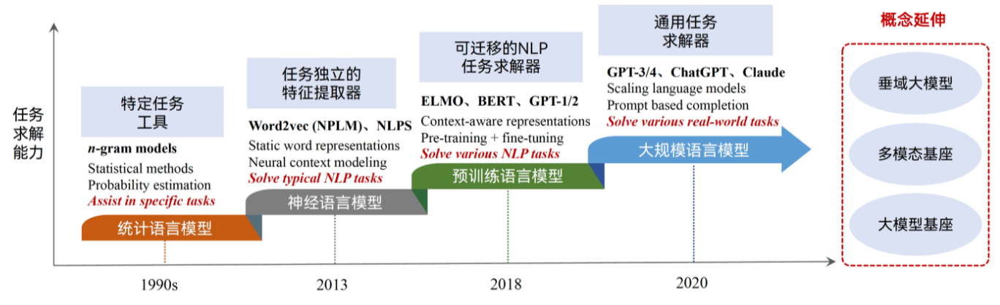
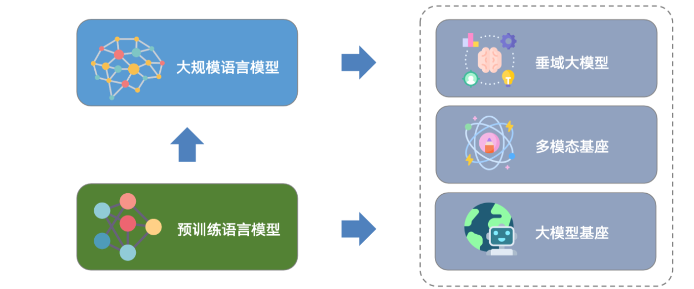
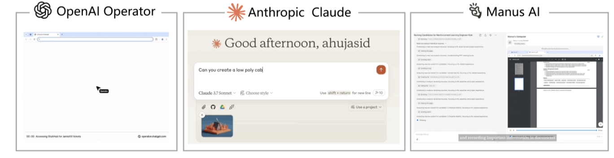

<h1 align="center">AI models introduce</h1>
<h1 align="center" >带小白们认识不同的知识，用最简易的描述来了解AI大模型原理！！！注：资源来自腾讯Ascoend，上海交通大学课教<h1>

  	
  
  
   	
  	
    
     

  <a href="#大模型发展过程">大模型发展过程</a>/
  <a href="#大模型分类">大模型分类</a>/
  <a href="#当前代表性大模型">当前代表性大模型</a>

<html xmlns="http://www.w3.org/1999/xhtml">
  <head>
   <meta http-equiv="Content-Type" content="text/html; charset=utf-8" />
  </head>
  <body>
    <h3 align="center">大模型发展过程</h3>
    
人工智能技术经历了小数据到大数据，小模型到大模型，专用模型到通用模型的发展历程，正逐步进入大模型时代。本章将介绍大模型的基本概念与范畴、发展过程、类型与特点以及当前代表性的大模型，并对本课程整体内容进行概述。
   

    </body>

<body>
  <h2>📚 教程目录</h2>
  <h3>大模型的基本概念与范畴</h3>
  <h3>从预训练语言模型到大规模语言模型的发展历程</h3>
  <h3>大模型的构建流程，扩展定律，涌现能力，幻觉</h3>
  <h3>大模型的前沿延身，如垂域大模型，多模态基座，智能体基座</h3>
  <h3>大模型安全风险，包括内容安全风险与行动风险</h3>
</body>
</html>
    <h1 align="center">大模型概念</h1>
    
    
<h3>人工智能技术经历了小数据到大数据，小模型到大模型，专用到通用的发展历程，正逐步进入大模型时代</h3>
      <h3>在海量无标注数据上进行大规模自监督预训练，学习到大量的语言知识与世界知识</h3>
<h3>通过自然语言交互完成多种任务，具备多场景，多用途，跨学科的任务能力</h3>
   
  
  <html> 
    <h1 align="center">大模型范畴</h1>
    
    <h1 align="center">大模型驱动内容智能</h1>
    <h3>大模型被广泛用于内容理解，分析推理与创作任务中</h3>
    
    <h1 align="center">智能躯体动的行为智能</h1>
    
    <h3>无处不在的"贾维斯"，大模型智能体展现出广泛的应用前景 </h3>
  </html> 
  
